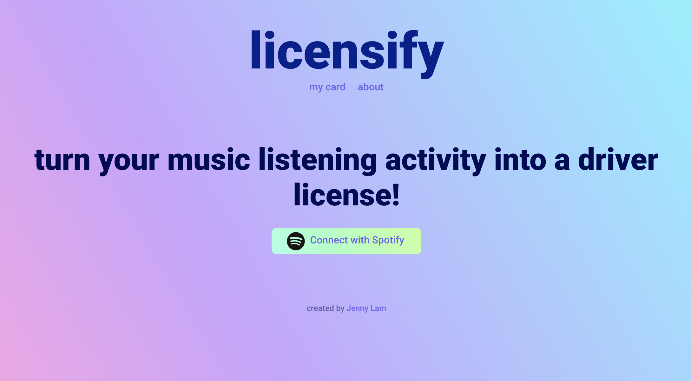
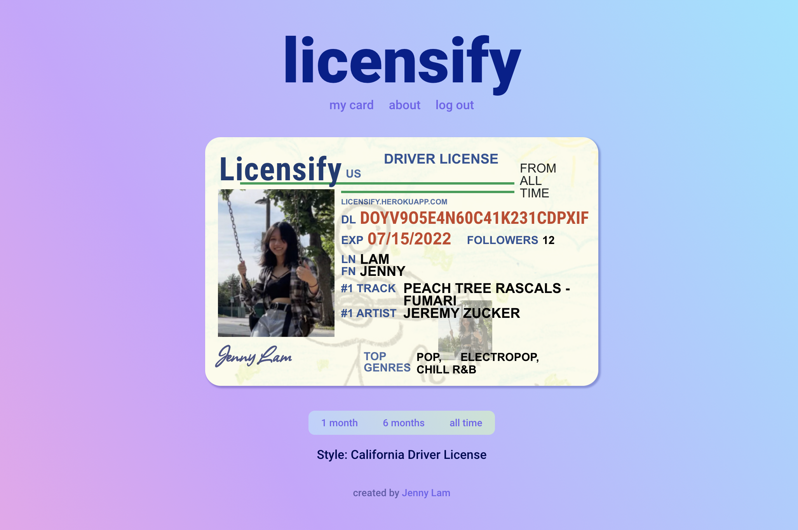

# Licensify

Licensify is a web app that takes a user's Spotify listening activity (top artists, tracks, and genres) and profile information (name, country, etc.) and generates a personalized driver license (in the style of a California driver license) based on the user's data.

## Demo

Try it out at [licensify.herokuapp.com](https://licensify.herokuapp.com/)!

## App Contents

### Login Page


Users can log in through authorization with Spotify.

### Personalized Driver License


Licensify generates a driver license based on the user's profile data and listening activity based on either the last month, last six months, or from all time. The default time range is six months, but users can pick other time ranges.

As of right now, the app only has one card style (California license), but maybe I might add more in the future.

## Built With
Licensify was built with React.js for the frontend and Express.js and Node.js for the backend. User authorization with Spotify was implemented using OAuth2 authorization flow and the Spotify Web API. The driver license itself was created using React.js and CSS and user data was retrieved from the Spotify Web API. 

## Future Tasks
- [ ] Have app retreive a new access/refresh token when user changes the time range. Right now, this only happens when the page is refreshed but changing the time range doesn't refresh the page. If someone leaves the web app open for over an hour, changing the time range would make the app get stuck on the loading screen until they refresh the page.

## Development
1. Register a Spotify App in the Spotify Developer Dashboard and add `http://localhost:8888/callback` as a Redirect URI in the app settings.

2. Create a `.env` file at the root of the project based on `.env.example` and add your unique `CLIENT_ID` and `CLIENT_SECRET` from the Spotify dashboard.

4. Install Node and dependencies. You can run the React app on <http://localhost:3000> and the Node server on <http://localhost:8888>.

```
# Install dependencies
$ npm install

# Run app
$ npm start
```

